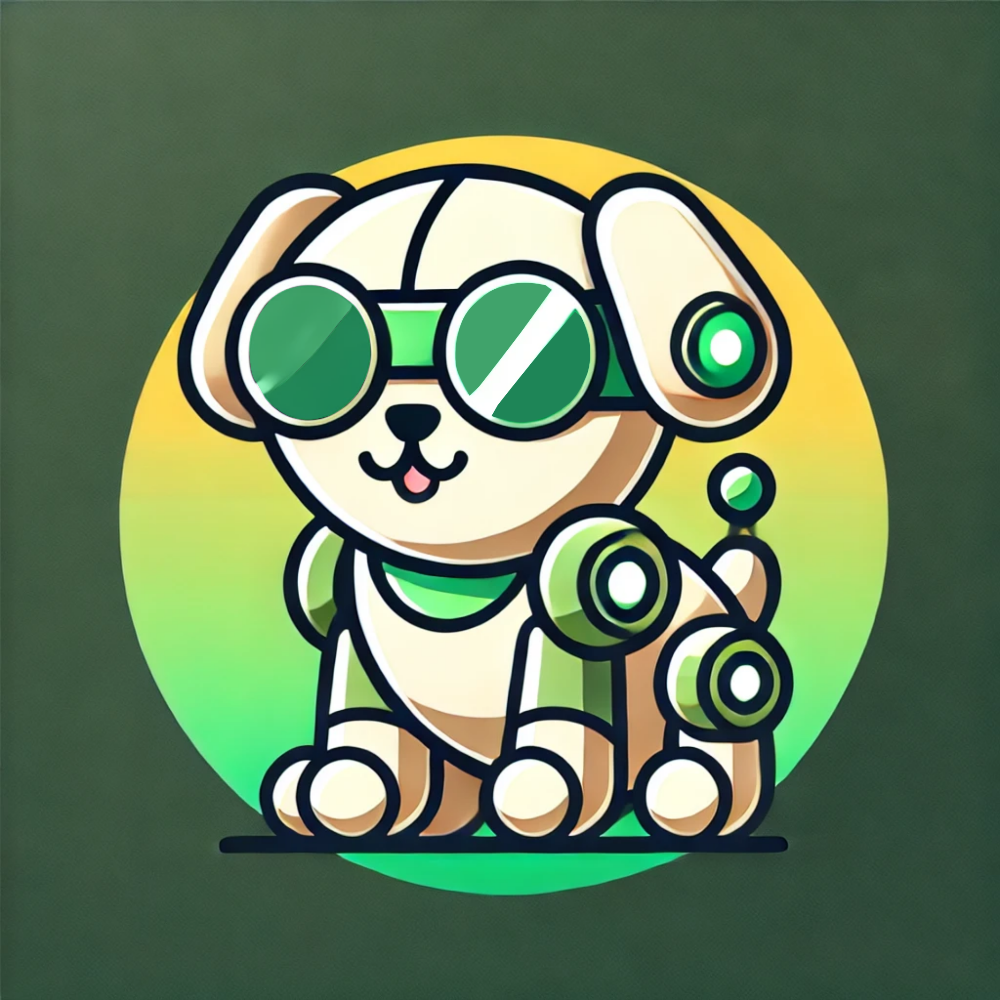

# euROBIN DLR Guide Dog

Simple and easy platform hack for image transfer in euROBIN

### Setup

1. Create a camera intrinsic file in the root directory of this repository with the same format as `dlr_camera_intrinsics.yaml` where `dlr` is replaced with your organization
2. Create a folder with the name of your organization e.g. `dlr`

### Usage

1. Push the image from your camera with the following name: `[euROBIN_name]:[some_date or identifier].png`. The euROBIN name can be obtained from the file `vision2eurobin_names`.
2. Wait until the associated `.yaml` file with the name `[euROBIN_name]:[some_date or identifier].yaml` is created.
