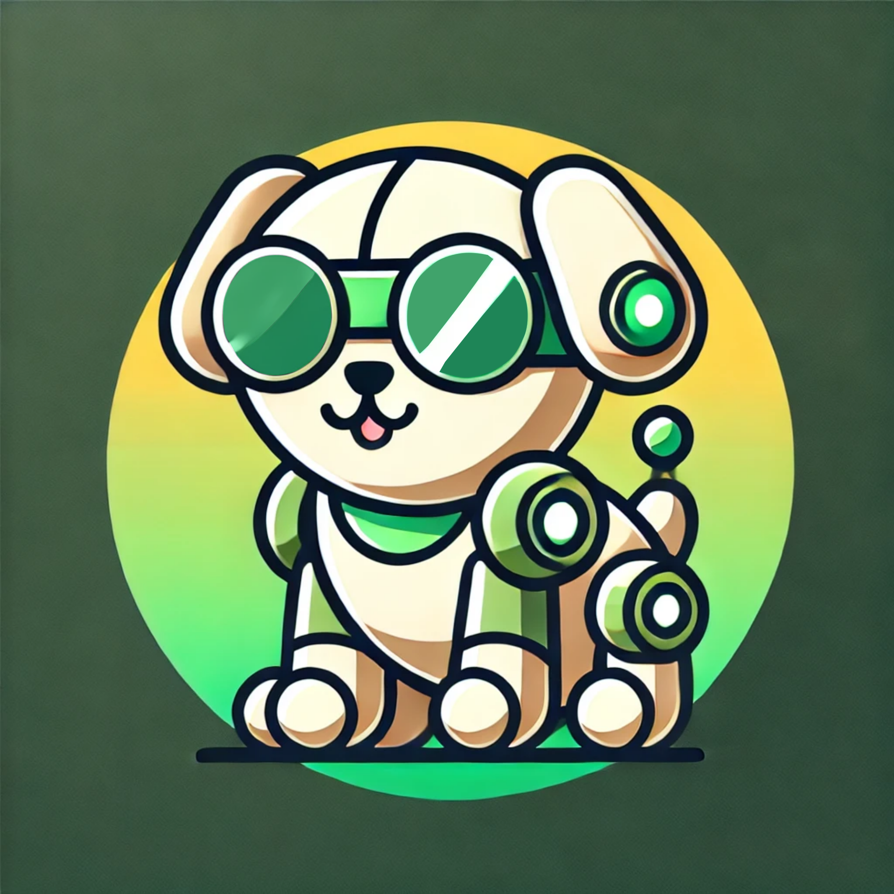

# euROBIN DLR Guide Dog

<p align="center">

<p>

Shared vision pipeline in euROBIN.

## Usage

### Install

Please setup conda on your machine.  
Then do:

```bash
conda init
conda create -n guide_dog
conda activate guide_dog
conda install --file requirements.txt
```

### Startup

```bash
cd guide_dog/scripts/
. start_backend_server.sh
```

optional:

```bash
./scripts/start_streamlit.sh
```

### API Documentation

http://127.0.0.1:8000/docs


