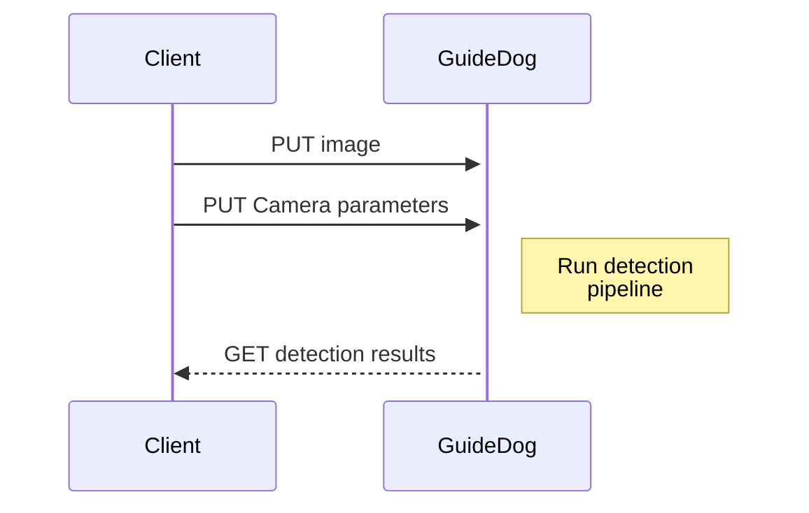

```mermaid


sequenceDiagram
    participant Client
    participant GuideDog

    Client->>+GuideDog: PUT image
    Client->>+GuideDog: PUT Camera parameters
    Note right of GuideDog: Run detection <br/> pipeline
    GuideDog-->>Client: GET detection results


```
